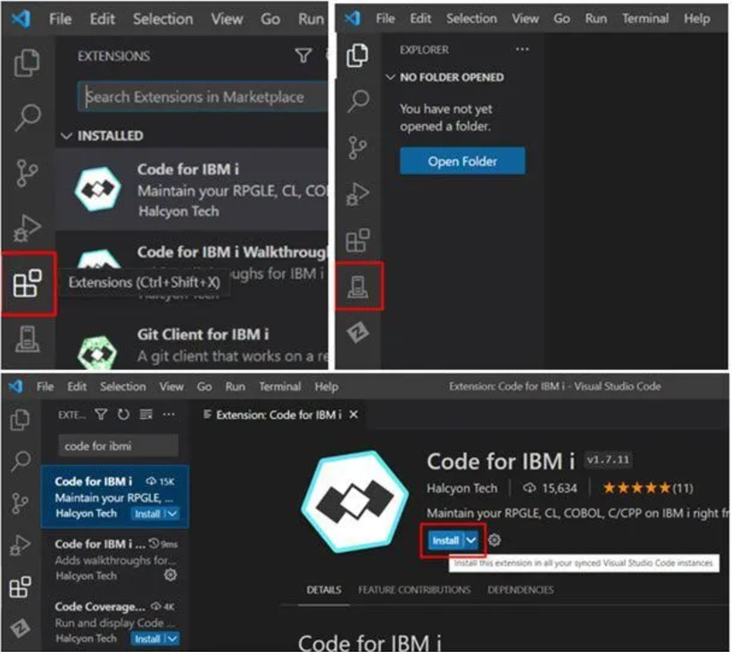
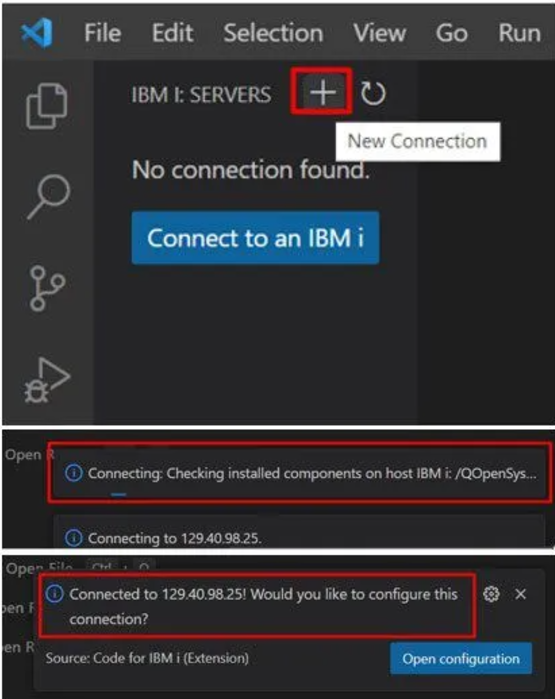

# Visual Studio Code na IBM i

## Opis

Ten poradnik pomoże Ci skonfigurować i używać Visual Studio Code (VS Code) w systemie IBM i. Visual Studio Code to popularny, lekki edytor kodu, który oferuje zaawansowane funkcje, takie jak debugowanie, obsługa wielu języków programowania oraz zintegrowane rozszerzenia, które ułatwiają programowanie w różnych środowiskach.

W tym repozytorium znajdziesz szczegółową instrukcję konfiguracji VS Code na IBM i, w tym instalację rozszerzeń, połączenie z systemem IBM i oraz zarządzanie obiektami i bibliotekami.

## Spis treści

1. [Co to jest Visual Studio Code?](#co-to-jest-visual-studio-code)
2. [Instalacja Visual Studio Code](#jak-zainstalować-vs-code)
3. [Instalacja rozszerzeń](#rozszerzenia-w-vs-code)
4. [Połączenie z IBM i](#połączenie-z-ibm-i)
5. [Zarządzanie bibliotekami użytkownika](#lista-bibliotek-użytkownika)
6. [Przeglądarka obiektów](#przeglądarka-obiektów)
7. [Przeglądarka systemu plików (IFS Browser)](#przeglądarka-systemu-plików-ifs-browser)
8. [Zalety korzystania z IBM i w VS Code](#zalety-korzystania-z-ibm-i-w-vs-code)
9. [Podsumowanie](#podsumowanie)

---

## Co to jest Visual Studio Code?

Visual Studio Code (VS Code) to lekki, open-source'owy edytor kodu stworzony przez firmę Microsoft. Jest popularny wśród programistów dzięki funkcjom takim jak:

- Intuicyjny interfejs użytkownika
- Obsługa wielu języków programowania
- Wbudowane narzędzia do debugowania
- Integracja z Git
- Rozszerzenia do dostosowywania edytora

---

## Jak zainstalować VS Code

1. Pobierz i zainstaluj Visual Studio Code ze strony [Visual Studio Code](https://code.visualstudio.com/).
2. Proces instalacji jest standardowy: kliknij "Pobierz" i postępuj zgodnie z instrukcjami.

---

## Rozszerzenia w VS Code

VS Code wspiera wiele rozszerzeń, które umożliwiają dostosowanie edytora do różnych języków programowania i środowisk. Aby używać VS Code z IBM i, musisz zainstalować odpowiednie rozszerzenie.

### Instalacja rozszerzeń:

1. Kliknij ikonę rozszerzeń w lewym pasku bocznym.
2. Wyszukaj „Code for IBM i” i kliknij "Zainstaluj".
3. Po zainstalowaniu rozszerzenia, uruchom ponownie VS Code.

---

## Połączenie z IBM i

Aby połączyć VS Code z systemem IBM i, musisz użyć rozszerzenia, takiego jak „IBM i Remote LPEX Editor” lub „IBM i Command Extension”.

### Kroki połączenia:

1. Kliknij ikonę IBM i w VS Code.
2. Wybierz „Połącz z IBM i”.
3. Wprowadź wymagane dane (adres IP, port SSH, login, hasło).
4. Kliknij „Połącz” i poczekaj na nawiązanie połączenia.

---

## Lista bibliotek użytkownika

Biblioteki użytkownika pozwalają na zarządzanie zasobami dostępnymi w IBM i.

- **Dodaj bibliotekę**: Kliknij „+”, wpisz nazwę i naciśnij Enter.
- **Zmień bieżącą bibliotekę**: Kliknij prawym przyciskiem myszy na nazwę biblioteki i wybierz „Zmień bieżącą bibliotekę”.

---

## Przeglądarka obiektów

W przeglądarkach obiektów możesz przeglądać obiekty w IBM i, edytować kod źródłowy i uruchamiać programy.

### Tworzenie nowego filtra:

1. Kliknij „Utwórz nowy filtr”.
2. Wypełnij wymagane pola (nazwa, biblioteka, typ obiektu).
3. Kliknij „Zapisz ustawienia”.

### Tworzenie nowego membra:

1. Kliknij „+” w pliku źródłowym.
2. Wpisz nazwę membra (np. `SQLRPGLE`).
3. Naciśnij Enter, aby utworzyć.
4. Zapisz plik klikając „Plik” → „Zapisz” lub używając skrótu `Ctrl+S`.

---

## Przeglądarka systemu plików (IFS Browser)

IFS Browser pozwala na zarządzanie plikami w systemie IBM i, w strukturze drzewa, podobnie jak w klasycznych eksploratorach plików.

### Przykład:

1. Kliknij prawym przyciskiem myszy na plik i wybierz opcję (np. „Utwórz nowy plik”).
2. Wpisz nazwę pliku (np. `testfile1.txt`) i dodaj zawartość.
3. Zapisz zmiany.

---

## Zalety korzystania z IBM i w VS Code

- **Usprawnione programowanie**: Nowoczesne narzędzia, które przyspieszają proces pisania kodu.
- **Kompatybilność międzyplatformowa**: Działa na Windows, macOS i Linux.
- **Zintegrowane debugowanie**: Narzędzia do debugowania i rozwiązywania problemów.
- **Wysoka integracja z IBM i**: Możliwość zarządzania obiektami, bibliotekami i plikami bez opuszczania edytora.

---

## Podsumowanie

Więcej informacji na temat konfiguracji VS Code z IBM i znajdziesz w [dokumentacji Code for IBM i](https://codefori.github.io/docs/login/). Korzystanie z VS Code w systemie IBM i pozwala na wydajniejsze programowanie, ułatwiając zarządzanie obiektami, bibliotekami i plikami.

